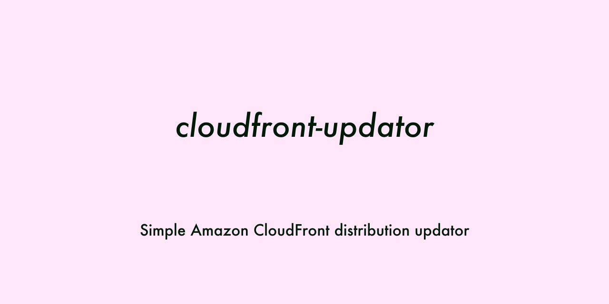

# CloudFront Update tools


Simple CloudFront distribution config updator.

## Badges

[](https://nodei.co/npm/cloudfront-updator/)  
[](https://badge.fury.io/js/cloudfront-updator)
[](https://opensource.org/licenses/MIT)
[](https://codeclimate.com/github/hideokamoto/cloudfront-updator/maintainability)
[](https://codeclimate.com/github/hideokamoto/cloudfront-updator/test_coverage)
[](https://travis-ci.org/hideokamoto/cloudfront-updator)

## Usage

### Configure

```typescript
import CloudFrontUpdator from 'cloudfront-updator'

const client = new CloudFrontUpdator({
  // You can define your expected the Distribution config
  updator: (id, DistributionConfig) => {
    DistributionConfig.Enabled  = false
    return DistributionConfig
  },
  // You can filter your distributions buy the function
  filter: (distribution) => distribution.Status === 'deployed'
}, {
  // Not running cloudfront.updateDistribution
  debugMode: true | false, // [default] false

  // How to update a several distribution, parallel is fast but sometime the AWS API will be throttle
  taskType: 'parallel' | 'sequential', // [default] sequential

  // If you want to enable / disable your distribution, you should set true
  allowSensitiveAction: false, // [default] false
})
```

### Update All Distributions
After configure the client, just run the method.

```typescript
await client.updateAllDistribution()

// If you want to update distribution per 10 items.
await client.updateAllDistribution(10)
```

### Upadte Specific Distribution
To run the task, we have to get the specific distribution object.

```typescript
const {Distribution: dist} = await (new CloudFront()).getDistribution({Id: 'EXXXXXX'}).promise()
if (!dist) return
await client.updateDistribution(dist)
```

### Debug / Dry run

```typescript
import CloudFrontUpdator from 'cloudfront-updator'

const client = new CloudFrontUpdator({
  // You can define your expected the Distribution config
  updator: ({id, arn}, DistributionConfig) => {
    DistributionConfig.HttpVersion = 'http2'
    return DistributionConfig
  },
  // You can filter your distributions buy the function
  filter: (distribution) => distribution.Status === 'deployed'
}, {
  debugMode: true,
})

const {Distribution: dist} = await (new CloudFront()).getDistribution({Id: 'EXXXXXX'}).promise()
if (!dist) return
await client.updateDistribution(dist)
const diff = client.getDiff()

{
  "added": {},
  "deleted": {},
  "updated": {
    "HttpVersion": "http2"
  }
}

```

## Contribution

```bash
// clone
$ git clone git@github.com:hideokamoto/cloudfront-updator.git
$ cd cloudfront-updator

// setup
$ yarn

// Unit test
$ yarn test
or
$ yarn run test:watch

// Lint
$ yarn run lint
or
$ yarn run lint --fix

// Build
$ yarn run build

// Rebuild docs
$ yarn run doc
```

### Commit message rule

The repository runs commitlint.
We have to follow "Conventional Commit" to make a commit message.

https://www.conventionalcommits.org/en/v1.0.0-beta.4/

```bash
$ git commit -m "<type>[optional scope]: <description>

[optional body]

[optional footer]"
```
